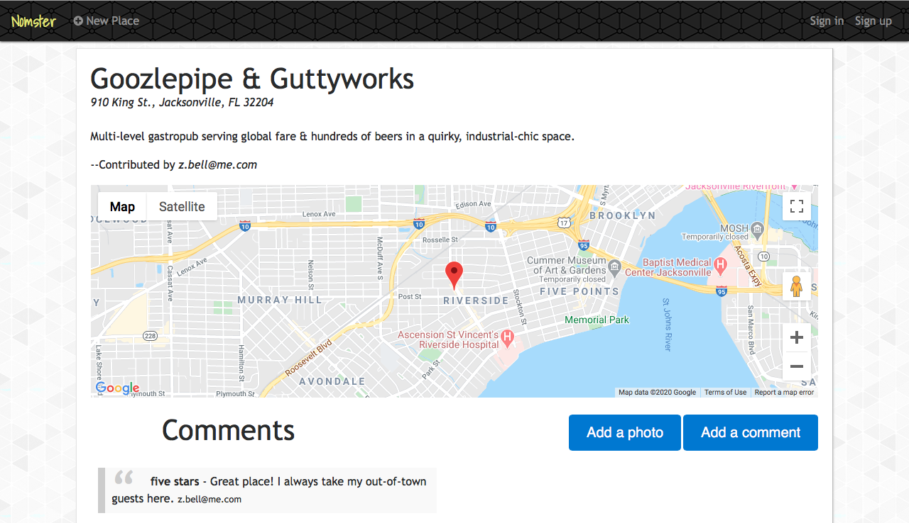

# Nomster

A Yelp clone featuring a crowd-sourced list of businesses. Nomster gives users the ability to create new listings, provide reviews and allows rankings and comments. This app utilizes Google Maps API to show users precise location of listings and is mobile responsive.

## Built With

* Ruby on Rails 5.2.3
* Ruby 2.5.3
* AWS S3 Storage

## Gems

* [Devise](https://github.com/heartcombo/devise) - User management and authentication
* [Carrierwave](https://github.com/carrierwaveuploader/carrierwave) and [MiniMagick](https://github.com/minimagick/minimagick) - Media uploading 

## Acknowledgments

* [The Firehose Project](https://thefirehoseproject.com)
